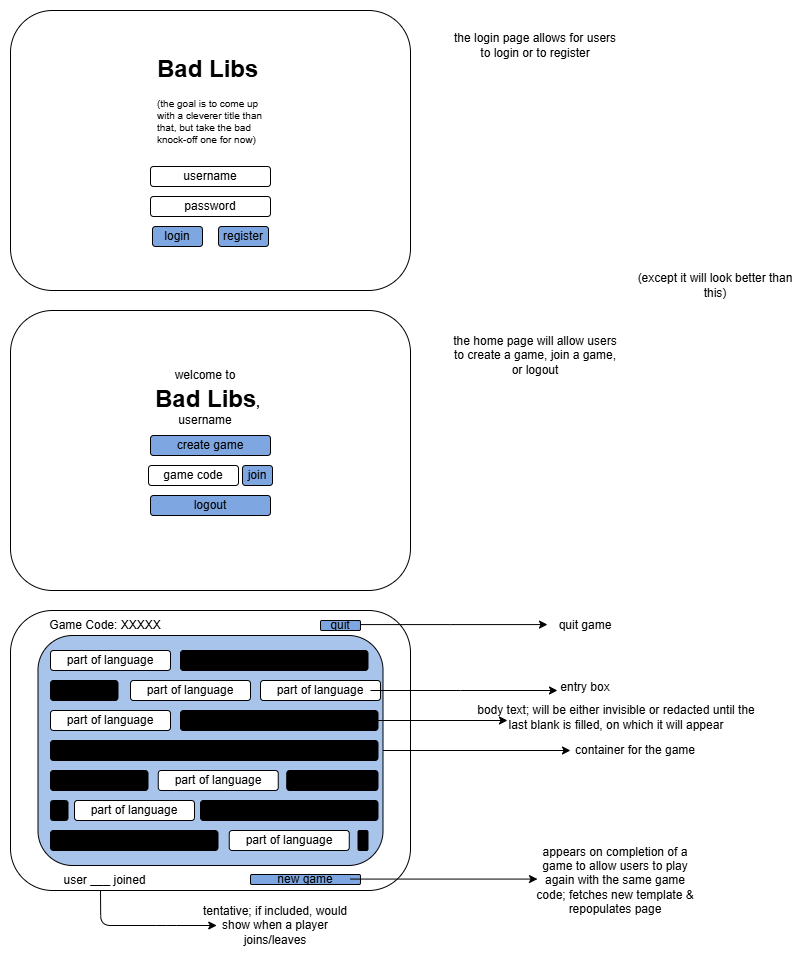
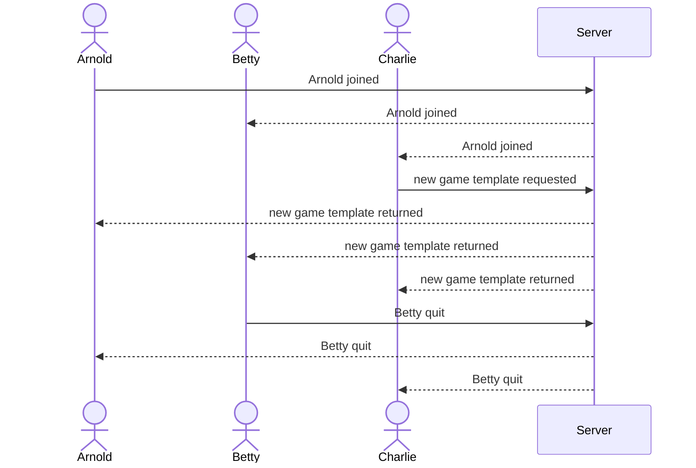

# Bad Libs

[My Notes](notes.md)

Bad Libs (name pending until I think of something better [i.e. something that either *isn't* a blatant rip-off of a copyrighted name, or is a cleverer rip-off]) is a realtime multiplayer online fill-in-the-blanks game. The template for the script is redacted during gameplay, allowing only the text boxes which need entry to be seen by players. Play is turn-based. A player may select any empty textbox and enter a word; after the word has been entered, the application automatically passes play to the next user (based on player ids handled on the backend). Once all words have been entered, the full text is revealed for the players to enjoy.

<!-- > [!NOTE]
> This is a template for your startup application. You must modify this `README.md` file for each phase of your development. You only need to fill in the section for each deliverable when that deliverable is submitted in Canvas. Without completing the section for a deliverable, the TA will not know what to look for when grading your submission. Feel free to add additional information to each deliverable description, but make sure you at least have the list of rubric items and a description of what you did for each item.

> [!NOTE]
> If you are not familiar with Markdown then you should review the [documentation](https://docs.github.com/en/get-started/writing-on-github/getting-started-with-writing-and-formatting-on-github/basic-writing-and-formatting-syntax) before continuing. -->

## 🚀 Specification Deliverable

<!-- > [!NOTE]
> Fill in this sections as the submission artifact for this deliverable. You can refer to this [example](https://github.com/webprogramming260/startup-example/blob/main/README.md) for inspiration. -->

For this deliverable I did the following. I checked the box `[x]` and added a description for things I completed.

- [x] Proper use of Markdown
- [x] A concise and compelling elevator pitch
- [x] Description of key features
- [x] Description of how you will use each technology
- [x] One or more rough sketches of your application. Images must be embedded in this file using Markdown image references.

### Elevator pitch

Are you tired of the classic fill-in-the-blanks game? Do your friends live too far away to play it with you? Bad Libs is a turn-based fill-in-the-blanks game that solves both of those problems. The game is hosted online, allowing friends to join from wherever they are; and, in a twist on the original game, the full script is kept a secret until every blank has been filled, making the reveal of the final story a fun surprise for everyone. Play is passed automatically from player to player, keeping the game fast-paced and enjoyable for all. Give Bad Libs a try to refresh your take on an old classic.

### Design

The layout in the diagrams above is a little cramped; this will be fixed in production.

The following sequence diagram depicts a couple of ways in which the players might interact with the server.

### Key features

- Secure login over HTTPS
- Live multiplayer gameplay (realtime updates of game state)
- Realtime updates when players join or leave
- Capability to create and join a game, allowing friends to play together
- 'Play again' functionality allows for multiple games to be played with the same game code (functions as a 'room', reducing hassle when starting a new game with the same group)

### Technologies

I am going to use the required technologies in the following ways.

- **HTML** - Use HTML to properly structure the pages. The pages will include a login page (users login or create an account), a main page (players create a game, join a game, or logout), and a game page (users play the game).
- **CSS** - Create style sheets to give the application consistent, accessible styling that is visually pleasing, and ensure that the application looks correct at various sizes.
- **React** - Provide login, joining a game, game display and update, etc.; will be used for routing and page components.
- **Service** - Backend service with endpoints for:
    - login/logout
    - account creation
    - submitting game/player info
    - retrieving game/player info
- **DB/Login** - Store user information credentials securely. Store game templates and game/player information. Register users and authenticate login. Can't create/join a game unless authenticated.
- **WebSocket** - Completed text box entries will be updated in real time for all players; players will be notified when another player joins or exits, and will be notified when it is their turn.

## 🚀 AWS deliverable

For this deliverable I did the following. I checked the box `[x]` and added a description for things I completed.

- [x] **Server deployed and accessible with custom domain name** - [My server link :)](http://ad-libs.click/).

## 🚀 HTML deliverable

For this deliverable I did the following. I checked the box `[x]` and added a description for things I completed.

- [ ] **HTML pages** - I did not complete this part of the deliverable.
- [ ] **Proper HTML element usage** - I did not complete this part of the deliverable.
- [ ] **Links** - I did not complete this part of the deliverable.
- [ ] **Text** - I did not complete this part of the deliverable.
- [ ] **3rd party API placeholder** - I did not complete this part of the deliverable.
- [ ] **Images** - I did not complete this part of the deliverable.
- [ ] **Login placeholder** - I did not complete this part of the deliverable.
- [ ] **DB data placeholder** - I did not complete this part of the deliverable.
- [ ] **WebSocket placeholder** - I did not complete this part of the deliverable.

## 🚀 CSS deliverable

For this deliverable I did the following. I checked the box `[x]` and added a description for things I completed.

- [ ] **Visually appealing colors and layout. No overflowing elements.** - I did not complete this part of the deliverable.
- [ ] **Use of a CSS framework** - I did not complete this part of the deliverable.
- [ ] **All visual elements styled using CSS** - I did not complete this part of the deliverable.
- [ ] **Responsive to window resizing using flexbox and/or grid display** - I did not complete this part of the deliverable.
- [ ] **Use of a imported font** - I did not complete this part of the deliverable.
- [ ] **Use of different types of selectors including element, class, ID, and pseudo selectors** - I did not complete this part of the deliverable.

## 🚀 React part 1: Routing deliverable

For this deliverable I did the following. I checked the box `[x]` and added a description for things I completed.

- [ ] **Bundled using Vite** - I did not complete this part of the deliverable.
- [ ] **Components** - I did not complete this part of the deliverable.
- [ ] **Router** - I did not complete this part of the deliverable.

## 🚀 React part 2: Reactivity deliverable

For this deliverable I did the following. I checked the box `[x]` and added a description for things I completed.

- [ ] **All functionality implemented or mocked out** - I did not complete this part of the deliverable.
- [ ] **Hooks** - I did not complete this part of the deliverable.

## 🚀 Service deliverable

For this deliverable I did the following. I checked the box `[x]` and added a description for things I completed.

- [ ] **Node.js/Express HTTP service** - I did not complete this part of the deliverable.
- [ ] **Static middleware for frontend** - I did not complete this part of the deliverable.
- [ ] **Calls to third party endpoints** - I did not complete this part of the deliverable.
- [ ] **Backend service endpoints** - I did not complete this part of the deliverable.
- [ ] **Frontend calls service endpoints** - I did not complete this part of the deliverable.
- [ ] **Supports registration, login, logout, and restricted endpoint** - I did not complete this part of the deliverable.

## 🚀 DB deliverable

For this deliverable I did the following. I checked the box `[x]` and added a description for things I completed.

- [ ] **Stores data in MongoDB** - I did not complete this part of the deliverable.
- [ ] **Stores credentials in MongoDB** - I did not complete this part of the deliverable.

## 🚀 WebSocket deliverable

For this deliverable I did the following. I checked the box `[x]` and added a description for things I completed.

- [ ] **Backend listens for WebSocket connection** - I did not complete this part of the deliverable.
- [ ] **Frontend makes WebSocket connection** - I did not complete this part of the deliverable.
- [ ] **Data sent over WebSocket connection** - I did not complete this part of the deliverable.
- [ ] **WebSocket data displayed** - I did not complete this part of the deliverable.
- [ ] **Application is fully functional** - I did not complete this part of the deliverable.
